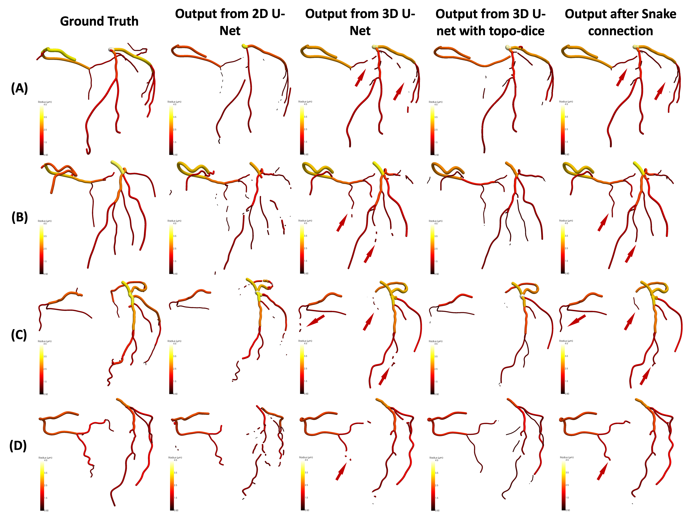

# CTA_repairment

Submitted to [MICCAI'24] Car-Dcros: Enhancing Cardiovascular Artery Segmentation through Disconnected Repairment and Open Curve Snake: A dataset and benchmark

## Key contributions

- ****Introducing Car-Dcros****, a novel pipeline designed to reframe CTA segmentation by incorporating disconnected component repairment and smoothness optimization.
- ****Providing an open-source dataset**** of synthetic cardiovascular trees specifically tailored for key points detection.
- ****Demonstrating state-of-the-art performance**** on vessel segmentation through benchmarking against three coronary CTA datasets.

## Dataset



The Cardiovascular Disconnected dataset is available [here](https://livejohnshopkins-my.sharepoint.com/:f:/g/personal/ywang687_jh_edu/EgyMcSDR0KFLv5H7U8OxV7gBcduChUr2CmDA9iaeT9vUFg?e=3LGcr2). It consists of the following data splits:

### Data Structure

| Type (graphs based imgs) | Train  | Validation | Test  |
| -------------------------| ------ | ---------- | ----- |
| ASCOS                    | 28     | 4          | 8     |
| ImageCAS                 | 140    | 20         | 40    |
| Ours                     | 0      | 0          | 10    |
| Sythesized               | 2688   | 384        | 928   |

For each data type, the dataset includes the following files:

**Raw_data**:

```
1. pulse_xxxxx_volume.nii.gz  % original volume
2. pulse_xxxxx_centerline.nii.gz  % extracted centerline
3. pulse_xxxxx_graph.graphml  % graph with edge information
```

**CTA Synthesized_data**:

```
1. xxx_idx_volume.nii.gz: Synthesized volume with a singular disconnection.
2. xxx_idx_kp1_part.nii.gz: Component kp1 extracted from the synthesized volume.
3. xxx_idx_kp2_part.nii.gz: Component kp2 extracted from the synthesized volume
```

## Data Synthesis

### Requirements

To set up the required environments, install the following dependencies:

- Numpy & SimpleITK:

```
pip install numpy
pip install SimpleITK
```

### Run

To generate synthesized data in bulk for training purposes, run the following command:

```
python data_synthesis.py -source_dir raw_data/ -target_dir synthesized_data/ -volume_num=30 -radius_min=1 -radius_max=15 -points_threshold=10
```
```
src_dir: Directory containing the raw data.
tgt_dir: Directory to store the synthesized data.
num_volumes: Number of disconnected volumes to generate for each original volume in the raw data.
min_radius, max_radius: Range of acceptable radii for selecting disconnected branches.
points_thresh: Minimum number of points required for an edge (centerline) to be selected as a disconnected branch.
```
